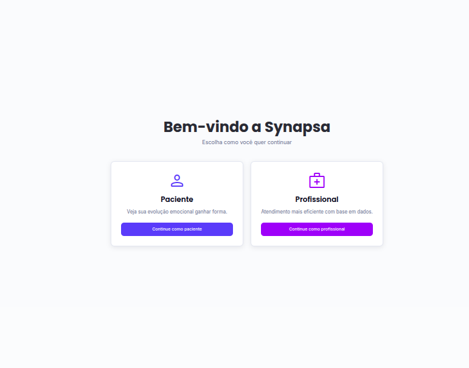
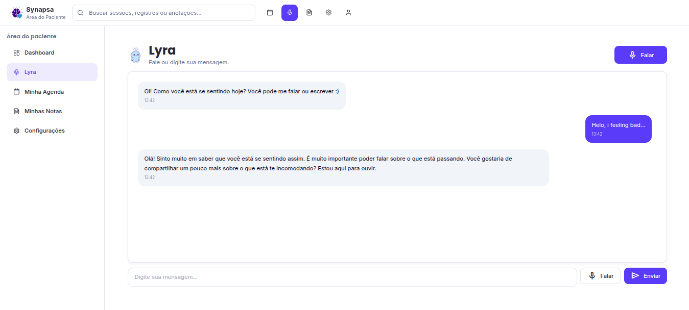
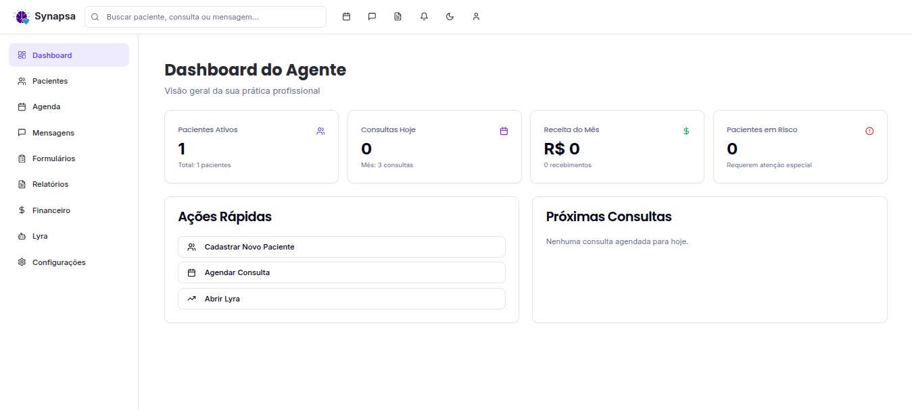
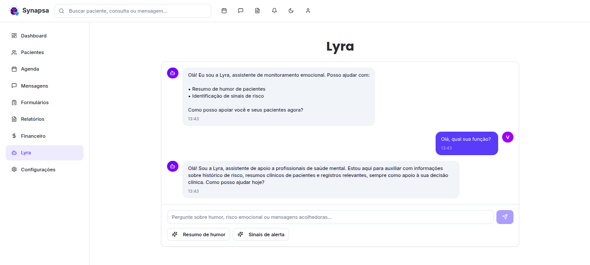

# Synapsa – Development Setup Guide


This document explains how to run the backend (LangGraph agents + FastAPI) and the frontend (Landing + App) in local development.

---
## 1. Frontend Setup (Vite + React + Shadcn)

- Install Dependencies(landing and app):

```
cd frontend/landing
npm install

// root from frontend/app
touch .env 
VITE_APP_URL=http://localhost:8080

```

```
cd frontend/app
npm install

// Api root
touch .env 
VITE_API_BASE=http://127.0.0.1:8000/api

```
- Application(landing and app):

```
cd frontend/landing
npm run dev
```

```
cd frontend/app
npm run dev
```

## 2. Backend Setup (FastAPI + Django)

- Requirements
- Conda (recommended)
- Python 3.12+

Postgres optional (if you want persistent LangGraph checkpoints)

---

- Install Dependencies
```
conda create -n synapsa python=3.12 -y
conda activate synapsa
```
```
cd/backend/chat
pip install -r requirements.txt
```

- Aplication(only agents):
```
cd backend/chat
uvicorn pipe.server.agent_server:app --port 8000 --reload
```

### Important Endpoints:
| Endpoint                          | Description                  |
| --------------------------------- | ---------------------------- |
| `POST /assistants/patient/invoke` | Invoke the **patient agent** |
| `POST /assistants/doctor/invoke`  | Invoke the **doctor agent**  |
| `POST /api/chat/{agent}`          | Alternate chat endpoint      |
| `GET /health`                     | Health check                 |


## Profiles:



### Pacients:


- Lyra pacient helper:


### Professionals:


- Lyra professional reports:



## 3. Full Architecture Overview

- Backend
```
backend/chat
 ├─ pipe/agent/patient.py
 ├─ pipe/agent/doctor.py
 ├─ pipe/server/agent_server.py   ← FastAPI + LangGraph bridge
 ├─ data/
 └─ requirements.txt
```
- Frontend
```
frontend/
 ├─ landing/   ← Public site 
 └─ app/       ← Synapsa Web App (patients + professionals)
```